# gscartsw2VGA

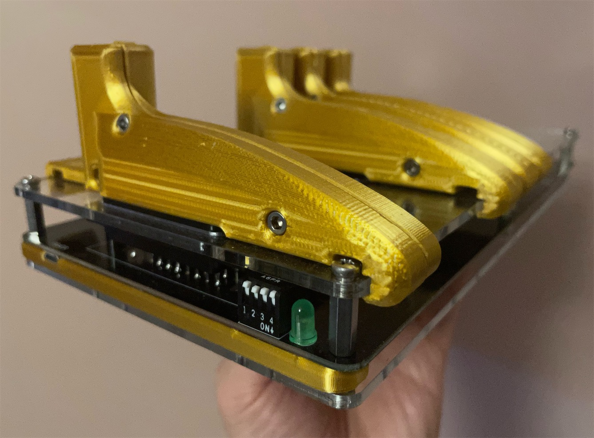

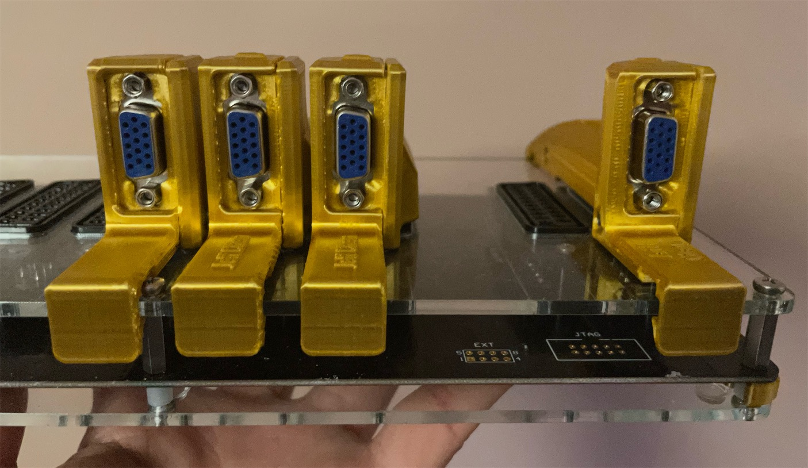
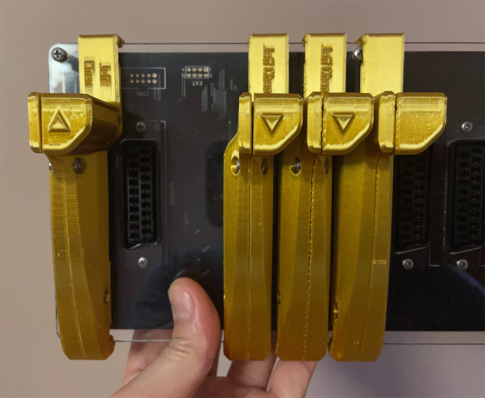
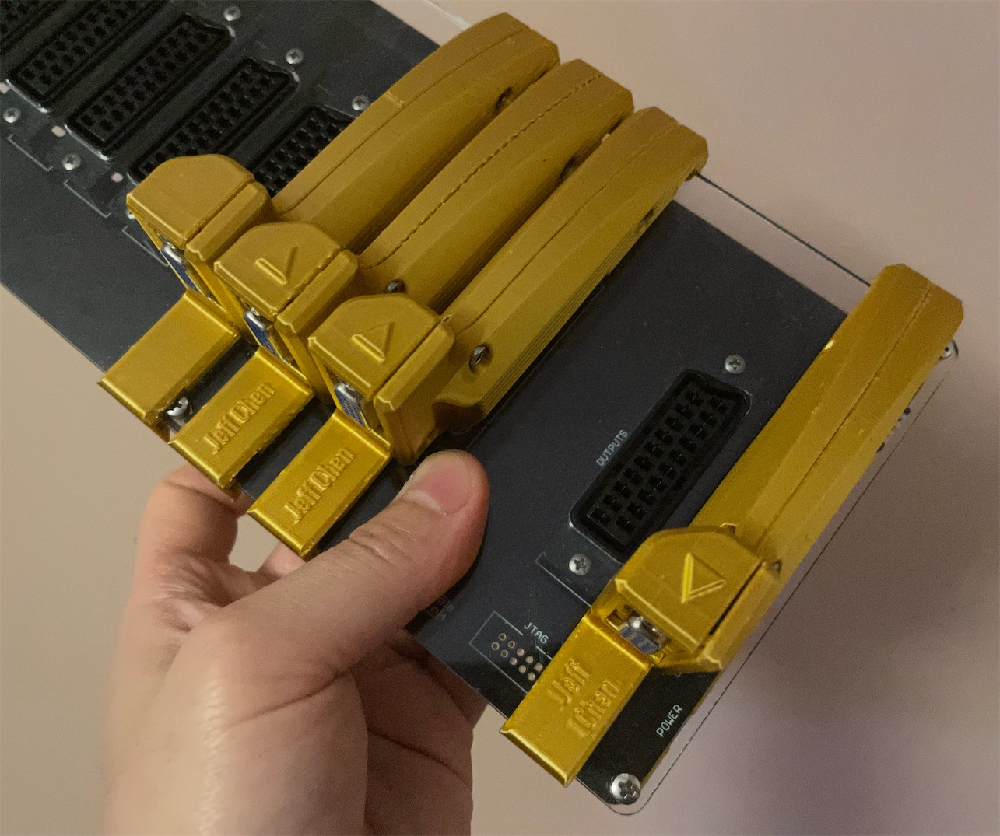
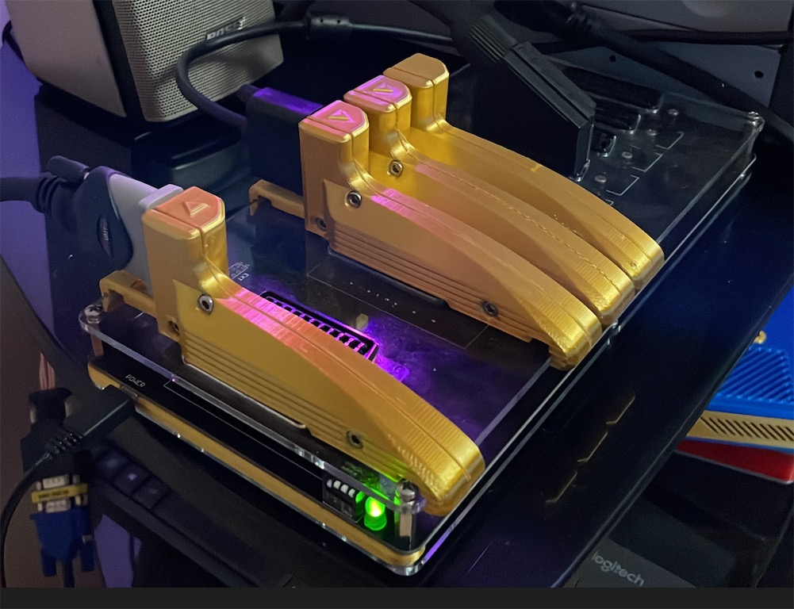
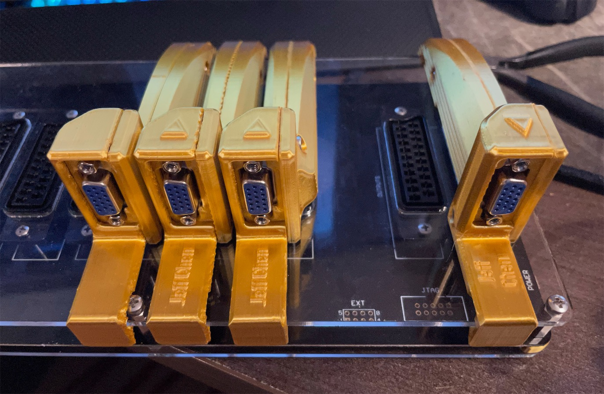
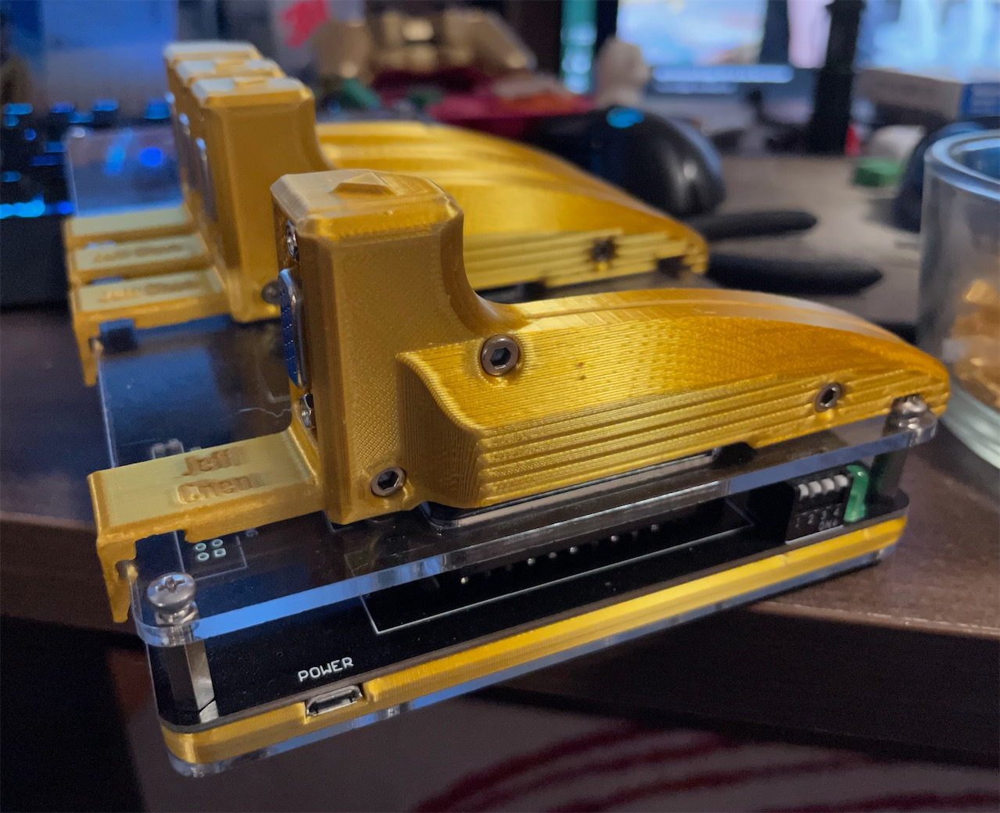
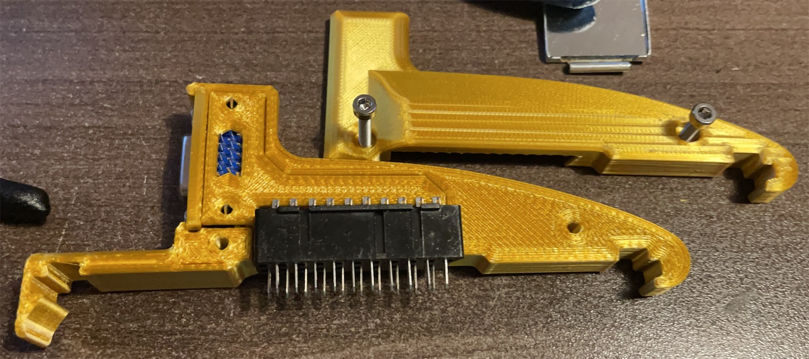
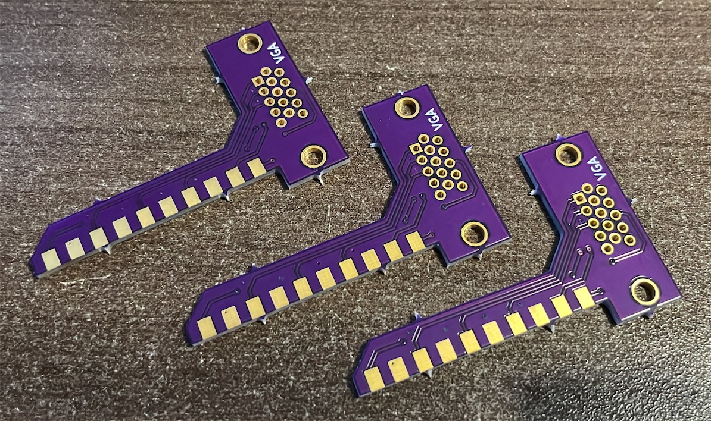
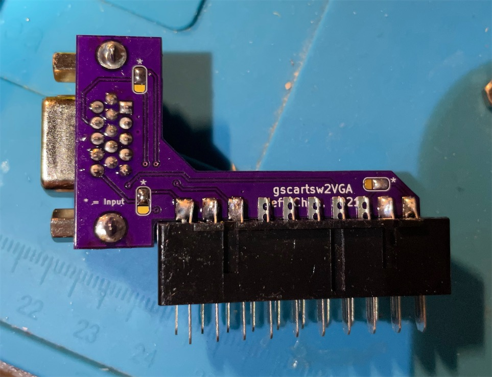
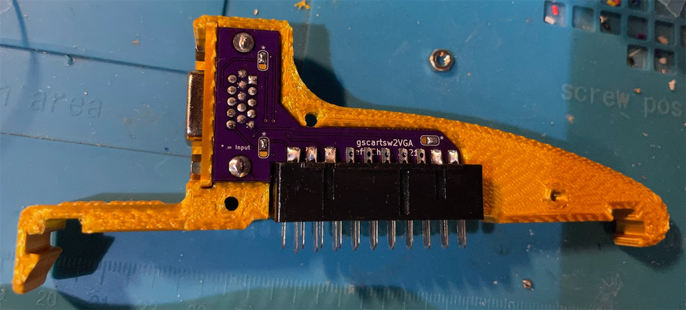

A VGA adapter for the gscartsw

This adapter converts the SCART ports on the gscartsw into D-Sub HD15 ports that accepts RGBS video signal as awell as stereo audio. This is a link among my series of VGA dongles to deal with various consoles and video switches using the RGBS video signal.

The adapter consists of, as simple as, a D-Sub HD15 port, a piece of PCB, a SCART male plug, and 3D printed shells.

-----

## Parts

- D-Sub HD15 VGA port femal slim
https://www.aliexpress.com/item/4000596805684.html

- SCART Male Plug
https://www.aliexpress.com/item/4000577027139.html

- [2x]M3x16mm, [1x]M3x8mm Hex Screws and Nuts
https://www.amazon.com/gp/product/B014OO5KQG

- PCB
https://oshpark.com/shared_projects/yMTYkeBh

- 3D Printed Shell

------

## Assembly

Clean up all the edges of the PCB, as there is no extra space inside the shell for any imperfection on the PCB.

Bridge the 3 jumpers on the PCB according to your use case. The star side of the jumpers mean INPUT. The other side is used for OUTPUT.

Solder in the VGA port on the side with the silk print "VGA".

Fit on the 3D printed VGA face panel, then slide the assembly into the big side of the shell, then fit in the SCART male plug.

Solder in at least two pins on the SCART plug to hold it in place. Then, take the assembly out of the 3D printed shell, and then proceed to solder the rest of the SCART plug pins onto the PCB with ample amount of solder.

Finally, put the VGA face panel back onto the internal assembly, and fit the assembly into the big side of the shell. Then close it up with the small side of th shell with the 3 sets of screws and nuts.

------

## Fitment Onto the gscartsw

Hook the curvy end of the adapter onto the edge of the acrylic panel. Align the SCART plug with one of the female SCART port on the switch. Then slightly pry the flap on the other end outwards with your index finger, so the hook on that side can safely pass the acrylic panel. Press the adapter flat and then let go. It will be on there securely.
